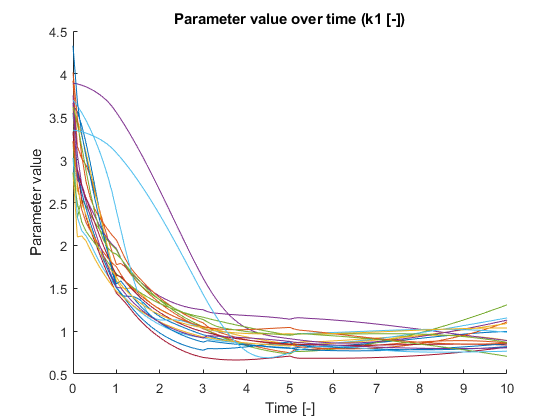

# pyADAPT

Analysis of Dynamic Adaptations in Parameter Trajectories

[http://bmi.bmt.tue.nl/sysbio/software/adapt.html](http://bmi.bmt.tue.nl/sysbio/software/adapt.html)

Implementation in Python

## Dev Plan

1. Reproduce a similar procedure in python
    - The toy model in MATLAB ✔
    - design Lotka model, generate data
    - trehalose model with van Heerden's glucose pulse response
2. Read Dissertation chapter 2 analysis and write an analysis routine
3. read least squares optimization on wikipedia and differential equations on Julia Diffeq's documentation (improve writing and documentation)
4. Parameter sensitivity analysis
5. core `pyADAPT` package
    - the `k3` parameter of toy model (see the matlab results)
    - the SBML format support
        - this is to support trehalose model
        - just converter
    - TODOs in the source code
    - plotting and profiling
6. trehalose model comparison with classical approach
7. finish CLI functions. in functional programming fashion.
    - convert, analysis
    <!-- https://cookiecutter.readthedocs.io/en/1.7.0/first_steps.html -->
    - maybe just leave the templating work to [cookiecutter](https://github.com/cookiecutter/cookiecutter).
8. write in Cython to speed up the ode solver.

## Investigate

1. Why won't `k1` start from a larger range at the beginning? Which should happen because the initial randomization is from 0.1 to 10.

2. Why the result of ADAPT in the *interface focus* paper shows an increasing `k1`? While pyADAPT and MFI both give a decreasing tendency?

