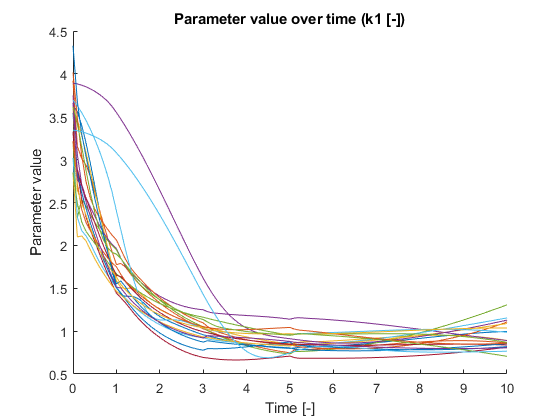
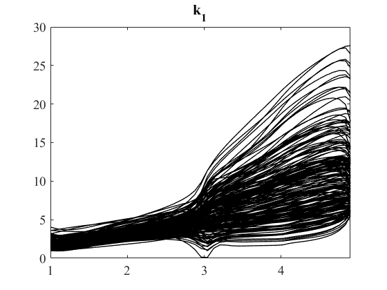

# pyADAPT

## extending ADAPT

1. problem not addressed in MATLAB

    If a value is changed but is not measured, how to initialize it. For example, if `R1` is a changing state in the model, but is not measured in the dataset. At the beginning of each time step, we still need to feed the algorithm the initial state of `R1`, but where should it come from?

2. sensitivity analysis module
3. visualization function lib
4. I am satisfied with the dataset except how it is initialized. maybe improve it.
5. cookiecutter

###

## Think

1. why the parameters fluctuate at the beginning??
2. how to interprete the results of pyADAPT? the change of the parameters, the total error, total regularization.

## FIX:

1. SBML model doesn't work on parallel because of pickling issues. will try `numexpr` and `pandas.DataFrame.eval`.
2. SBML model cannot be run in pyADAPT yet. because of issue (1) and not handling the boundary condition species corrently. Still need a table to store constants like boundary species. current workaround is to write Smallbone model by hand.

## Investigate

1. Why won't `k1` start from a larger range at the beginning? Which should happen because the initial randomization is from 0.1 to 10.

2. Why the result of ADAPT in the *interface focus* paper shows an increasing `k1`? While pyADAPT and MFI both give a decreasing tendency?

